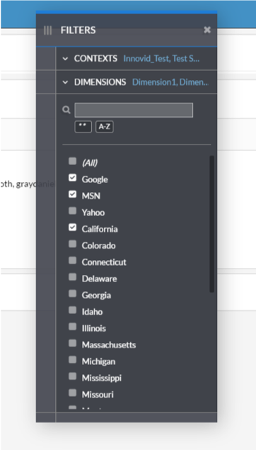
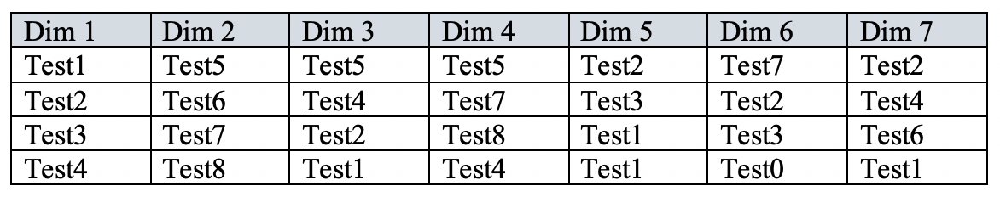
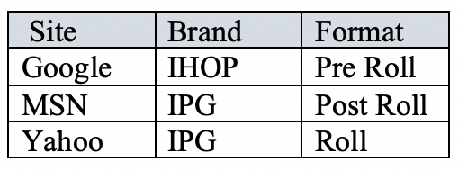
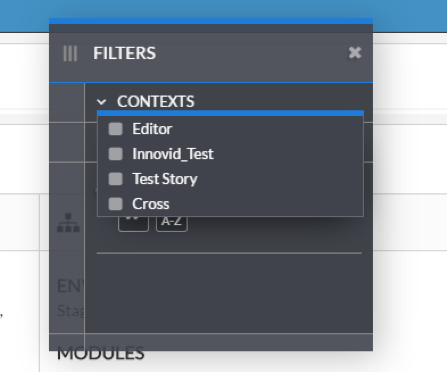
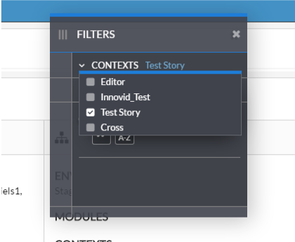
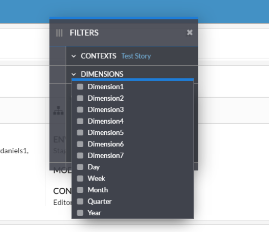
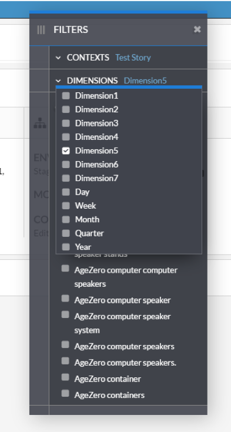
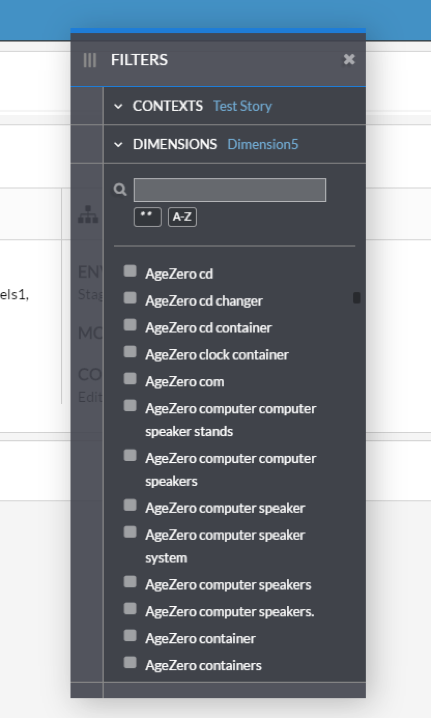
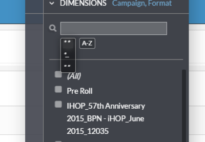
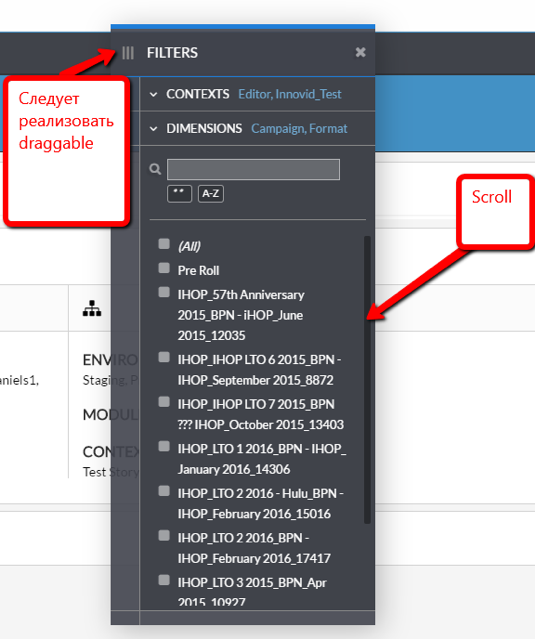

# Filter Widget

Create a widget for data filtering



## Description

Input data for the component is filters, that are built from several tables.

**Table 1**



**Table 2**



There may be any count of such tables.

### Contexts dropdown

**Contexts** dropdown is responsible for tables selection, from which filters are formed afterwards. Initial state - no tables selected.



### Dimensions dropdown

**Dimensions** dropdown items are initialized right after table is selected inside **Contexts** dropdown. Each item from **Dimensions** dropdown stands for a column in respective table.

 

When a column selected, filter list is populated with all unique rows from selected table+column (see example above, **Test Story** table, **Dimension 5** column)

 

### Search

Implement three types of search:
1. Exact match
1. Partial match
1. Starts with

Alphabetical sorting should be implemented as well.



### Drag-n-Drop



### Tech tips

Widget's state should be kept in store (flux) or in reducer (redux).

State getter must return the following data structure:

```
const result = [
    {
        tableId: 1,
        filters: [
            { columnId: 1, name: 'Google' },
            { columnId: 2, name: 'Test' },
            { columnId: 2, name: 'react' },
            { columnId: 3, name: 'css' },
        ],
    },
    {
        tableId: 2,
        filters: [
            { columnId: 1, name: 'Google' },
            { columnId: 2, name: 'Test' },
            { columnId: 2, name: 'react' },
            { columnId: 3, name: 'css' },
        ],
    },
];
```

### Persistence

There must be an option to save / restore widget's state.
